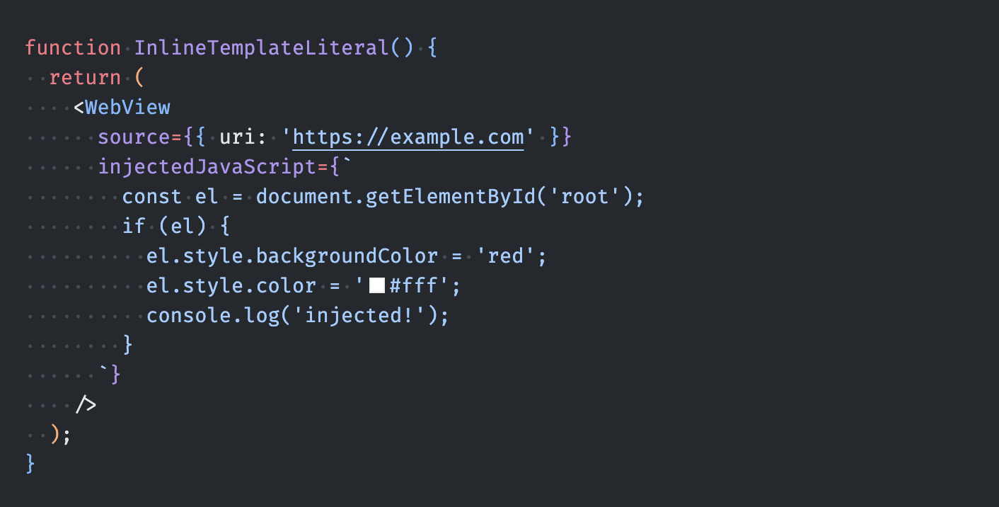
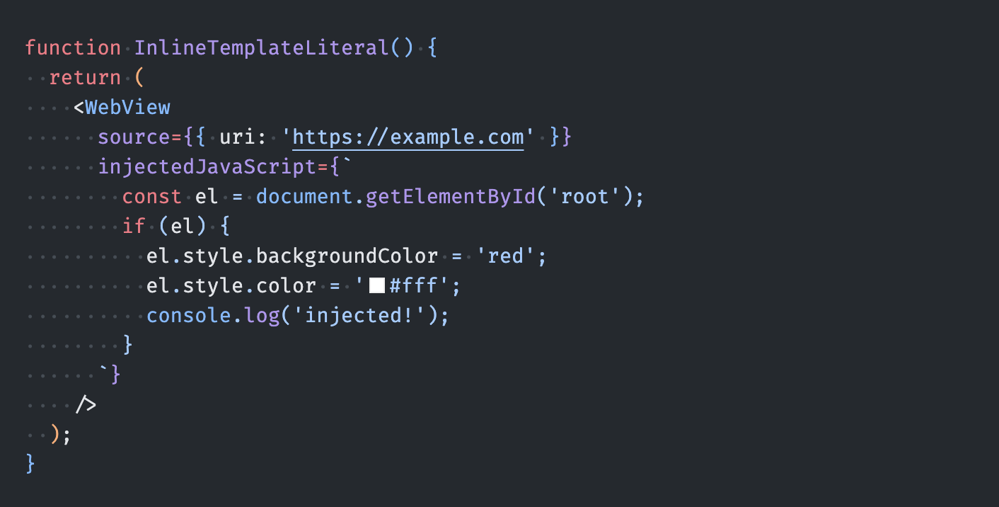

# React Native WebView Lens

JavaScript syntax highlighting for `react-native-webview`'s `injectedJavaScript` and `injectedJavaScriptBeforeContentLoaded` props.


## The Problem

When using `react-native-webview`, injected scripts are plain strings — your editor treats them as opaque text with no syntax highlighting.

**Before** — no highlighting, hard to read:



**After** — full JavaScript syntax highlighting:



## Supported Patterns

### Inline template literal

```tsx
<WebView injectedJavaScript={`document.body.style.backgroundColor = 'red';`} />
```

### Variable reference (same scope or module-level)

```tsx
const script = `document.body.style.backgroundColor = 'red';`;
// ...
<WebView injectedJavaScript={script} />
```

### String literals (single and double quotes)

```tsx
const script = "document.body.style.backgroundColor = 'red'";
// ...
<WebView injectedJavaScript={script} />
```

All patterns work with both `injectedJavaScript` and `injectedJavaScriptBeforeContentLoaded`.

## Supported File Types

`.js`, `.jsx`, `.ts`, `.tsx`

## How It Works

- **Inline template literals** use a TextMate injection grammar for zero-cost highlighting
- **Variable references** and **string literals** use AST analysis with `@typescript-eslint/typescript-estree` to trace declarations and apply semantic token highlighting

## Known Limitations (v0.1)

- Variable tracking only works within the same file
- Variable shadowing is not handled — the first matching declaration is used

## License

MIT
